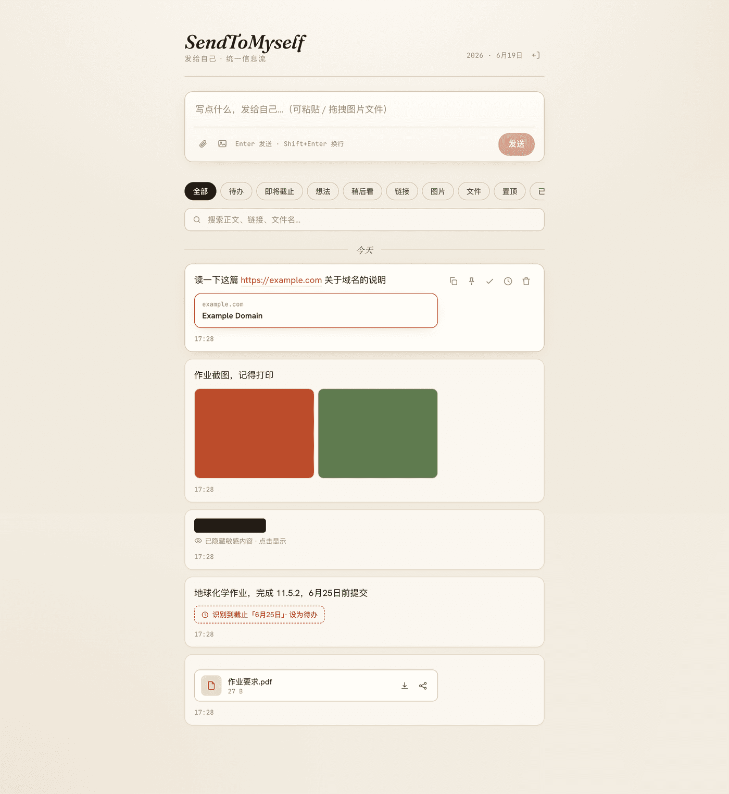
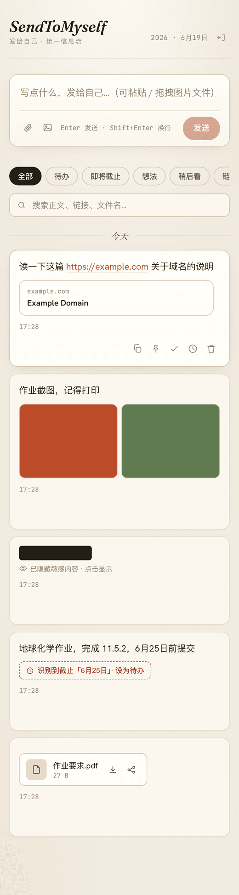
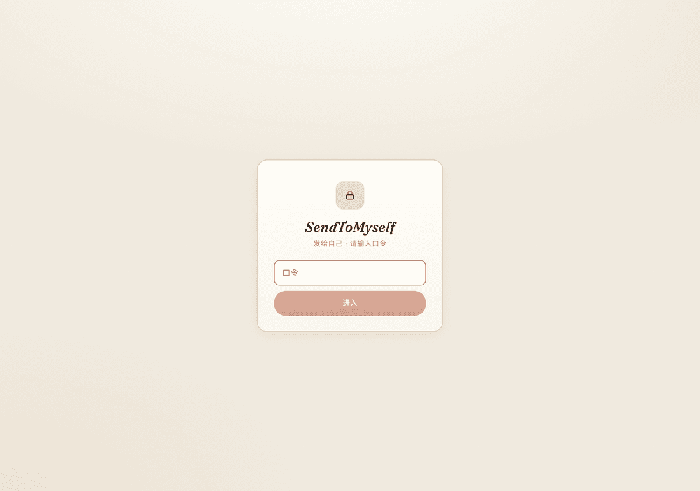

# SendToMyself

> A self-hosted, cross-platform inbox for sending text, links, images, files, and tasks to yourself.

部署在个人 NAS、通过域名访问的**单用户**跨平台「发给自己」统一信息流。用来替代「微信发给自己」，但搜索和后续处理能力更强。

在任意设备上，把文字、链接、图片和文件快速发进去；在其他设备**立即**获取；需要长期保留的内容可以搜索、标记、设为待办或设置截止时间。

完整需求与边界见 **[docs/SPEC.md](docs/SPEC.md)**（单一事实来源）；竞品与决策调研见 **[docs/RESEARCH.md](docs/RESEARCH.md)**。

<p align="center">
  
  
  
</p>

界面取向「温纸墨痕」：暖纸背景 + Fraunces 衬线刊头 + 赤陶橙强调色。链接自动生成预览卡，图片服务端生成缩略图，疑似密钥自动遮罩。

## 功能（V1 MVP 已实现）

发送即入库、查看时再分类——一种数据（`Item` + `Attachment`），多种视图。

- **发送**：文字 / 链接 / 图片（粘贴·拖拽·选择）/ 文件，可混合；Enter 发送，上传不阻塞输入
- **统一时间线**：倒序、按天分组、游标分页、增删动画
- **实时同步**：SSE 推送，一台发送另一台已开页面立即出现（`/realtime` 独立抽象，预留 WebSocket）
- **链接预览**：自动抓取标题/域名/封面/favicon（**防 SSRF**：拦截内网地址、限超时/大小/跳数、Content-Type 白名单）
- **图片/文件**：服务端缩略图、原图预览、下载、移动端系统分享、保留原文件名与 MIME
- **自动识别（纯规则，无 AI）**：URL 提取、中文 DDL 识别（`chrono-node`，**仅建议需确认**）、疑似密钥前缀 → 自动遮罩
- **待办与 DDL**：一键转待办、快捷日期、到期分桶（已过期/今天/明天/本周）、勾选完成；`isTodo` 与内容属性正交
- **分类与状态**：想法 / 稍后看、置顶、敏感遮罩、软删除回收站（可恢复）
- **搜索**：中文子串全文搜索；敏感项参与索引、结果隐藏正文
- **认证**：单用户 argon2id 口令 + session cookie + 登录限速锁定
- **PWA** + 响应式移动端

## 技术栈（锁定）

全 TypeScript pnpm monorepo：

| 目录 | 内容 | 里程碑 |
|---|---|---|
| `apps/web` | React + Vite + TanStack Router/Query + motion + PWA | **V1 ✅** |
| `apps/api` | Hono + better-sqlite3 + Drizzle + SSE + argon2/sharp | **V1 ✅** |
| `packages/shared` | Item/Attachment 类型 + zod 校验 + 规则识别 | **V1 ✅** |
| `apps/harmony` | ArkTS 原生薄壳（Share Kit） | V1.1 |
| `apps/android` | Capacitor 薄壳（`ACTION_SEND`） | V1.2 |
| `apps/desktop` | Tauri 薄壳（Win/Mac） | V1.3 |

存储：SQLite（数据）+ 本地文件系统（附件，`STORAGE_ROOT` + `storageKey`）。
**明确否决**：Next.js · PostgreSQL · Redis · 对象存储 · 消息队列 · 微服务（[SPEC §18](docs/SPEC.md)）。

## 本地开发

需要 Node ≥ 20、pnpm 11。原生模块（better-sqlite3 / argon2 / sharp）会按本机架构编译。

```bash
pnpm install
# 若原生模块二进制缺失：npm_config_build_from_source=true pnpm rebuild better-sqlite3
pnpm dev          # 同时启动 api(:8787) 与 web(:5173)
```

打开 http://localhost:5173 。开发态默认不设 `AUTH_PASSWORD` → 认证关闭（控制台会告警）。

常用脚本：

```bash
pnpm -r run typecheck                       # 全量类型检查
pnpm --filter @sendtomyself/api db:generate # 改表后生成 Drizzle 迁移
pnpm --filter @sendtomyself/web build       # 前端生产构建
```

## 部署（Docker Compose）

单容器：API 同时托管前端静态资源；数据库与附件落盘到 `./data` 卷。前面接反向代理终止 HTTPS。

```bash
cp .env.example .env       # 务必设置一个强 AUTH_PASSWORD
docker compose up -d --build
```

服务监听 `127.0.0.1:8787`，将反代（Caddy/Nginx）指向它即可。环境变量见 [.env.example](.env.example)。

## 备份与恢复（SPEC §13）

> 未恢复过的备份等于无备份。

```bash
scripts/backup.sh                       # 在线一致性快照 + 附件 + JSON 导出 → ./backups/stm-<时间戳>/
scripts/restore.sh backups/stm-xxx --dry-run   # 恢复演练（校验完整性，不动现网）
scripts/restore.sh backups/stm-xxx             # 真正恢复（停服→覆盖→重启）
```

字段加密密钥（若启用）与服务端口令均不在备份内。

## 威胁模型（边界）

传输全程 HTTPS；落盘默认依赖 NAS 卷加密。**不防御服务器被完全攻破**（那需要端到端加密，V1 不做）。本工具定位「快速发给自己」，非密码保险箱。详见 [SPEC §12.4](docs/SPEC.md)。

## License

MIT
